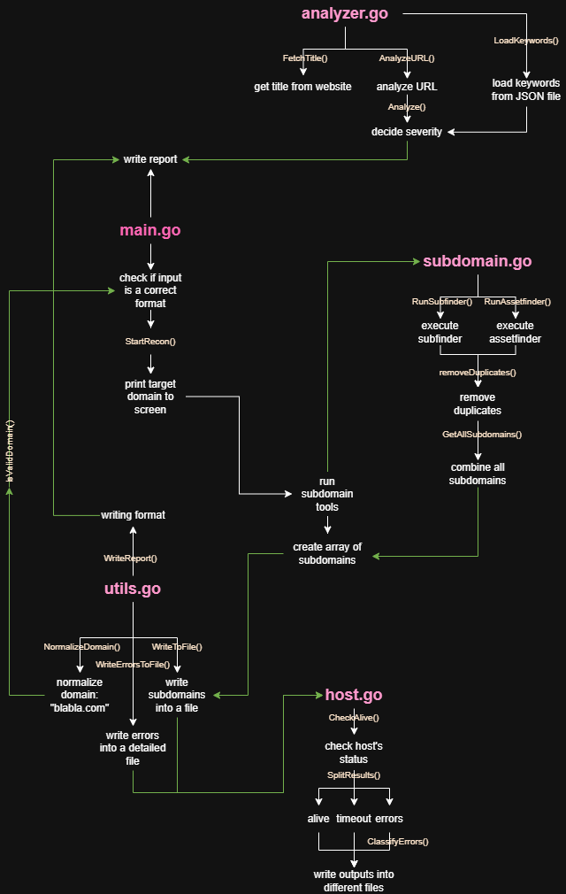

# ReconTriage 🔍

ReconTriage is an automated reconnaissance and analysis tool that helps security researchers and bug bounty hunters quickly identify high-value targets.

Instead of overwhelming users with raw recon data, it collects, processes, and prioritizes results so you can directly focus on critical attack surfaces.

---

## ⚙️ Requirements & Setup

Before running ReconTriage, make sure the following are installed and available in your system PATH:

* Go (1.20 or higher)
* subfinder
* assetfinder

### Install Go

https://go.dev/dl/

Verify installation:

```bash
go version
```

---

### Install subfinder

```bash
go install github.com/projectdiscovery/subfinder/v2/cmd/subfinder@latest
```

---

### Install assetfinder

```bash
go install github.com/tomnomnom/assetfinder@latest
```

---

### Add Go binaries to PATH (IMPORTANT)

**Windows (PowerShell):**

```bash
setx PATH "%PATH%;%USERPROFILE%\go\bin"
```

**Linux/macOS:**

```bash
export PATH=$PATH:$(go env GOPATH)/bin
```

Verify tools:

```bash
subfinder -h
assetfinder
```

---

## 🚀 Installation & Usage

```bash
git clone https://github.com/spnelifeyza/ReconTriage.git
cd ReconTriage
go mod tidy
go run main.go example.com
```

---

## 🧠 How It Works

ReconTriage performs the following pipeline:

* Collects subdomains using subfinder and assetfinder
* Removes duplicates and aggregates results
* Checks which hosts are alive
* Processes URLs
* Extracts page titles
* Analyzes results using keyword-based logic
* Classifies targets into:

  * HIGH
  * MEDIUM
  * LOW

Example output:

```
[HIGH]  https://admin.example.com      → Admin Panel
[HIGH]  https://api.example.com/login  → Login Page
[MED]   https://dev.example.com        → Development Server
[LOW]   https://www.example.com        → Homepage
```

---

## 🏗️ Code Architecture

The diagram below shows how ReconTriage processes data from input to prioritized output.

<p align="center">
  <a href="images/arch.png">
    
  </a>
</p>

---

## 📁 Project Structure

```
ReconTriage/
│── main.go
│── go.mod
│
├── internal/
│   ├── subdomain/
│   ├── host/
│   ├── analyzer/
│   └── utils/
│
├── images/
│   └── arch.png
│
└── outputs/
```

---

## 📌 Notes

* External tools must be installed and in PATH
* Missing dependencies will cause runtime errors
* The tool uses system binaries (subfinder, assetfinder), not Go libraries

---

## ⚠️ Disclaimer

This tool is intended for educational purposes and authorized security testing only.
Do not use it against systems without permission.

---

 ## Feyza SAPAN

---
